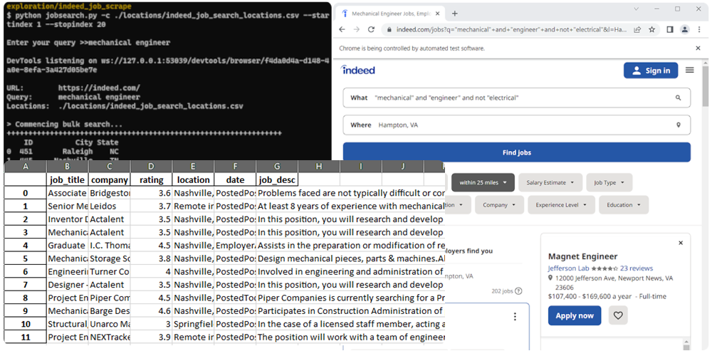
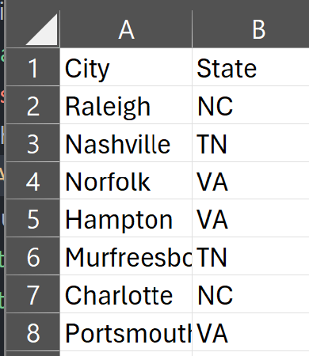
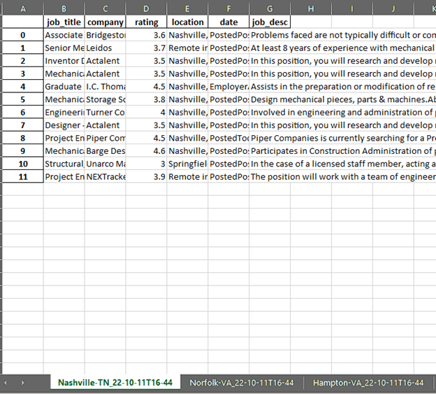
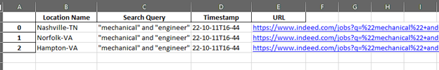

********************
indeed-jobs-searcher
********************

Simple CLI-based tool for extracting and storing relevant job info. from bulk job searches on indeed.com.

It would be remiss of me if I didn't say that I used Sidharth's project (explained here: https://www.pycodemates.com/2022/01/Indeed-jobs-scraping-with-python-bs4-selenium-and-pandas.html)
as the base of this job searcher. Running Sidharth's code showed me a workable proof of concept (after tweaking the code) for extracting
and storing useful job information from Indeed, using Selenium and BeautifulSoup -- neither one of which I have much experience with.

From there I scaled up for my needs. I am using my data analytics skills to compile a list of top cities where I wish to live and work
after I graduate (based on several factors: different measures of diversity, cost of living, proximity to friends and family, etc.).
Part of my analysis is figuring out which of my prospective cities has the jobs I'm looking for. Hence this project was born. I derive a
CSV file of cities by printing out a ``DataFrame`` from my analysis and then I plug the CSV file into my jobs searcher to capture available
jobs for each location into an Excel workbook which I can import with ``pandas`` for the next phase in my analysis.

As a current Natural Language Processing (NLP) student, I am interested in ameliorating the usefulness of this program by using sentiment
analysis and classification (perhaps via a neural net) to help gauge the viability of jobs per location. Unfortunately, that will probably
happen in the distant future as I barely have sufficient time to write this readme file.

.. contents:: Contents

Changes
########

- Added query argument (-q or --q)
- Treat a job's rating as 0 if no rating is present (no empty rating cells)
- Removed support for ID column in locations CSV file
- Updated scraper module to adapt to LinkedIn's HTML format changes.
- Adapted `jobsearch` module so it can be imported from external modules (which can call on `jobsearch.single_search` and `jobsearch.batch_search`)

A Note for the Instructions
###########################

My examples use the command ``python3`` which is specific to Linux. If you are using Windows, simply use ``python`` instead.

Requirements
############

- Device with Internet access and Google Chrome web browser installed
- Python 3.10.6 or newer on device

Setup
#####

Setup virtualenv
----------------

For this project, we want to first set up a virtual environment. This way, we can install
dependencies to this virtual environment rather than our global Python environment. This
will allows us to isolate our dependencies.

1. First, open your terminal to the main folder of this cloned repository and make sure you
have the virtualenv package installed:

``pip install --user virtualenv``

In Ubuntu-based distributions, you can install it using:

``sudo apt install python3-venv``

2. Create the virtualenv (still in the main repo folder):

``python3 -m venv venv``

3. Activate it.

3a. In PowerShell:

``\venv\Scripts\activate``

3b. In Linux:

``source venv/bin/activate``

To deactivate it (when you want to use your user Python environment), simply type
``deactivate``.

4. Install the requirements.

``pip install -r requirements.txt``

(You will have to use ``pip3`` in Linux)

Usage (command line)
####################

For Bulk Searching
------------------
For bulk searching, you will need to feed in a CSV file of your locations. The CSV file format has been simplified:

1. The first column from the left must contain a location name.
2. The second column from the left may be used to specify a more general region (e.g., state, providence) or it may be left blank.

Refer to the following image as a reference:

Execute!
--------

Refer to the ``help menu`` depicted below by running ``python3 jobsearch.py -h``.

.. code-block::

    Usage (help):              jobsearch.py -h, jobsearch.py --help

    Usage (single search):     jobsearch.py -l "<location name>" [options]
      Options:
        -f, --file <file name> Custom file name (can include path).
        -q, --query <query>    The job search query.
        -u, --url <Indeed URL> Tailor URL to country (defaults to USA).
        -s, --save <boolean>   True if unspecified. False if false value is given.

    Usage (batch search):      jobsearch.py -c <locations CSV file> [options]
      Options:
        -f, --file <file name> Custom file name (can include path).
        -q, --query <query>    The job search query.
        -u, --url <Indeed URL> Tailor URL to country (defaults to USA).
        -s, --save <boolean>   True if unspecified. False if false value is given.
        --startindex <int>     0-based row index in CSV file to start from (inclusive).
        --stopindex  <int>     0-based row index in CSV file to stop after (inclusive).

    Examples (single search):
      jobsearch.py -l "Johnson City, TN" -q "('software engineer' OR 'software developer')"
      jobsearch.py -l "Tokyo" -u https://jp.indeed.com -q "software engineer"
      jobsearch.py -l "Tokyo" -u https://jp.indeed.com -f "C:\Users\User\Desktop\ty-job-search"
      jobsearch.py -l "Tokyo" -u https://jp.indeed.com -f /home/user/Desktop/ty-job-search
      jobsearch.py -l "Bengaluru" -u https://in.indeed.com --save false

    Examples (batch search):
      jobsearch.py -c locations/southeast-cities. -q "('software engineer' OR 'software developer')"
      jobsearch.py -c locations/southeast-cities.csv -f "C:\Users\User\Desktop\SE-jobs-search"
      jobsearch.py -c locations/southeast-cities.csv -f /home/user/Desktop/SE-jobs-search
      jobsearch.py -c locations/indian-cities.csv -u https://in.indeed.com
      jobsearch.py -c locations/southeast-cities.csv --startindex 10
      jobsearch.py -c locations/southeast-cities.csv --stopindex 10
      jobsearch.py -c locations/southeast-cities.csv --startindex 10 --stopindex 20

    Locations CSV file format
      Each row can have one or two locations (e.g. city or city, region) but no more.
      The left column should specify the city. The right column should specify the region/province/state.

      The first row may be used as the column names.

      Example file format:
        City        State
        Birmingham  AL
        Richmond    KY
        Georgetown  KY

    Saved Files
      If no file path is specificied (using the -f argument)
      the resulting files are saved in the searched_jobs folder.

Saved Files
###########
If no file path is specificied (using the -f argument) the resulting files are saved in the **searched_jobs** folder.

Bulk Search Example
###################

Understanding ``startindex``, ``stopindex``
-------------------------------------------

Assume we execute the script as such:

.. code:: bash

    python3 jobsearch.py -c ./locations/southeast-cities.csv --startindex 1 --stopindex 3

Next we enter our job query. You can use Boolean logic if you'd like:

.. code::

    Enter your query >>"mechanical" and "engineer" and not "electrical"

The indexing is zero-based (as a programmer, it's the only way for me!). What that means is that the second, third, and fourth
locations in the file will be searched (the ``stopindex`` is inclusive):

*locations/southeast-cities.csv*

.. code-block::

      City		State
    Raleigh		NC  <-- Index 0
    Nashville	TN  <-- Index 1 (start here)
    Norfolk		VA
    Hampton		VA  <-- Index 3 (stop after scraping for this location)
    Murfreesboro	TN
    . . .

The Results
-----------

The results are stored in the **searched_jobs** folder (unless a custom path was used in the file argument. The first part of each
default file name (before the underscore) is a timestamp of when the data was scraped.

The scraped job-search data are stored in the Excel workbook with ``bulk-job-searches.xlsx`` in its name. Each sheet in the workbook
features the results for each location searched from the locations CSV file.

The locations searched, the entered job query, and the resulting URLs from which the results were scraped are stored in the Excel
workbook with ``bulk-urls-searched.xlsx`` in its name.

Single Searches
################

A single search produces a similar Excel workbook file but for convenience, the worksheet also has a URL column listing the URL
of the page from which the program scraped its results. The workbook name will end with ``single-job-search``.

**NOTE**: When you perform a single search, if your location is more than one word, it is important that you enclose your query in quotation marks, e.g.,

.. code:: bash

    python3 jobsearch.py -l "Johnson City, TN"
    python3 jobsearch.py -l "Chicago, IL" -q "('software engineer' OR 'software developer')"

